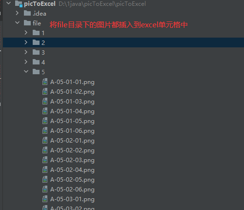
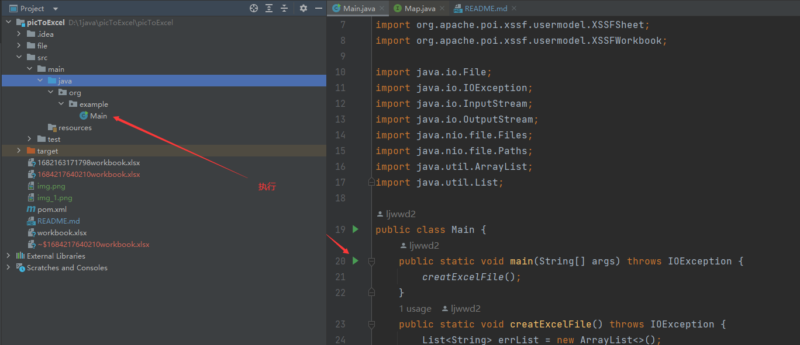
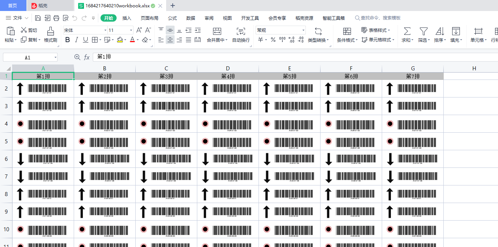

# 将条码图片批量嵌入到Excel单元格中
业务场景：

需要将条码图片存到excel之中方便归档。

效果展示：
直接运行org.example.Main.main()就会将file目录中的图片插入到excel中，并且在项目根目录会生成一个.xlsx文件。

最后生成的excel文件中的内容如下：

核心流程：
1. 处理好图片文件的名字，以及文件位置，便于循环处理。

2. 修改creatExcelFile()或者新建一个方法，通过调用org.example.Main.writePicToExcel()，实现插入图片到指定单元格中。